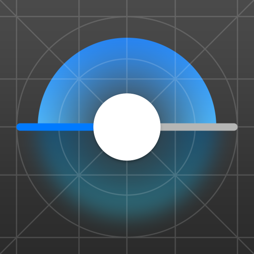
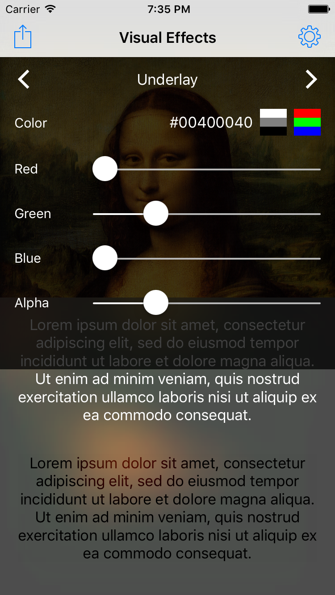

Visual Effects Playground
---

Visual Effects Playground is a tool for designers and developers of iOS apps that allows trying out different blur and vibrancy visual effect styles available in iOS SDK in a form of `UIVisualEffectView`:

- See precisely how your photos, UI, or any other imagery would look with a blur effect applied.
- Quickly check legibility of text on top of blurred content, with or without vibrancy effect applied.
- Experiment with effect styles and background, overlay, underlay and text colors without writing any code.
- Export the result of applied visual effects as image to share it with others.

Adjustable options
---

The following customization options are available in the app:

- Set the background image (take photo, choose from Photo Library, import from other apps).
- Set the background color (portion of the background not filled by the image).
- Choose the visual effect style for blur and vibrancy: Dark (`UIBlurEffectStyleDark`), Light (`UIBlurEffectStyleLight`) or Extra Light (`UIBlurEffectStyleExtraLight`).
- Choose translucent navigation bar style: Default/Light (`UIBarStyleDefault`) or Black (`UIBarStyleBlack`).
- Set the "underlay" color (layered behind the blur: `blurEffectView.backgroundColor`).
- Set the "overlay" color (layered on top of the blur: `blurEffectView.contentView.backgroundColor`).
- Show/hide and set the color of text on top of the blur.
- Show/hide and set the tint color of text with a vibrancy effect applied.
- Adjust the size of blurred layer.

All customizable colors provide a HEX value and both grayscale and RGBA controls.

**Note:** Vibrant text tint color affects the actual color of the text only on iOS 9.3 (in beta at the time of writing). On older iOS versions, only its Alpha component is effective.

License
---

[MIT License](LICENSE.md)
